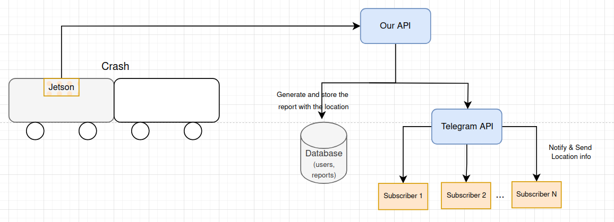

# Jetson-Notification-Service

## Architecture

With the use of our publicly available Telegram bot @road_guards_bot, users can subscribe to it to receive alerts related to a specific vehicle. We can

The jetson module inside of the car will make a call to our API in case of a crash, resulting in a message from the bot (containing the location of the accident as a google maps URL) being sent to all the subscribers.

## Bot Interaction (On User Interaction)

## Bot Interaction (On Crash)

## Future Work

In future work, I will extend to provide two more solutions: Accidents Broadcasting, so that the vehicles involved in accidents should quickly broadcast an accident message to warn approaching vehicles to exercise caution, and Vehicle Intruder Alert Detection, to detect and alert about the existence of an unauthorized user inside of the user’s vehicle.
